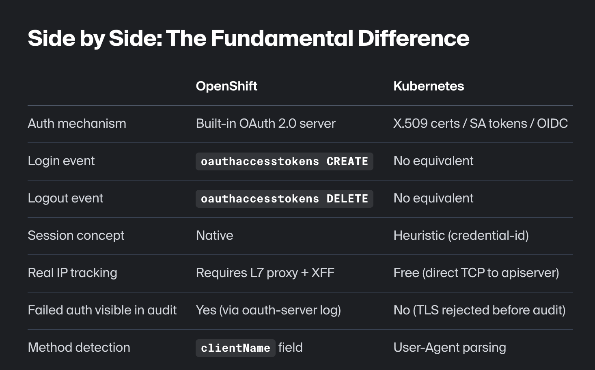

## Day 1


### Article 1
Slow start of kubernetes pods. A volume has to be mounted to pod. The restart was performed by rollout restart of statefulset. The pod was in init state for 30 minutes. The kubelet showed context deadline exceeded which means api server is unresponsive during this time. Below error in logs

```bash
[pod_workers.go:1298] "Error syncing pod, skipping" err="unmounted volumes=[atlantis-storage], unattached volumes=[], failed to process volumes=[]: context deadline exceeded" pod="atlantis/atlantis-0" podUID="83089f13-2d9b-46ed-a4d3-cba885f9f48a"
```

When checking logs on node where the pv is getting mounted, below log was observed

```bash
[volume_linux.go:49] Setting volume ownership for /state/var/lib/kubelet/pods/83089f13-2d9b-46ed-a4d3-cba885f9f48a/volumes/kubernetes.io~csi/pvc-94b75052-8d70-4c67-993a-9238613f3b99/mount and fsGroup set. If the volume has a lot of files then setting volume ownership could be slow, see https://github.com/kubernetes/kubernetes/issues/69699
```

kubelet was running `chgrp -R` everytime pv was mounted to node to update permissions. The pod spec had spec.securityContext included fsgroup: 1. As the current user runs as non-root, the permissions of all files need to be updated to access. So, this was causing the timeout issues.

By default, fsGroupChangePolicy is `Always`, so permissions are getting restarted everytime node starts. If it is set to `OnRootMismatch` then the time to start reduced drastically.

```yaml
spec:
  template:
    spec:
      securityContext:
        fsGroupChangePolicy: OnRootMismatch
```

### Article 2

Kubernetes does not have traditional login concept. The login is performed by SA tokens and certificates. 

Authentication in Kubernetes works through:

- X.509 client certificates — system:admin in kubeconfig uses a cert
- Service Account tokens — pods use JWT tokens mounted at runtime
- OIDC — optional external integration
- Static token files — legacy, rarely used

What We Capture on Kubernetes

- "Session start" (first request per credential-id)
- Real client IP (kube-apiserver sees it directly — no proxy needed!)
- Authentication method (kubectl vs browser vs API)
❌ No logout events (certificates don't expire mid-session)
❌ No failed login attempts (invalid certs get TCP-rejected before audit)

Openshift has built in oauth-openshift server to manage authentication/authorization.



### Reference

- https://blog.cloudflare.com/one-line-kubernetes-fix-saved-600-hours-a-year/
- https://blog.audit-radar.com/why-kubernetes-has-no-login-and-how-we-solved-it-for-auditradar