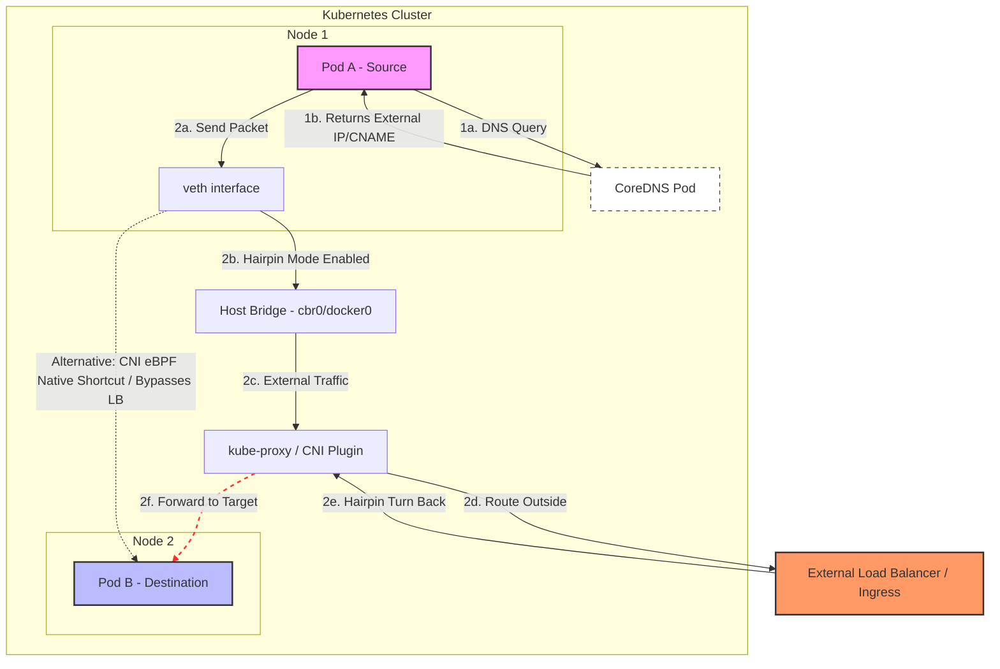

## Day 4

### ipBlock in NetworkPolicy

The `ipBlock` field allows you to define ingress and egress rules for specific IP ranges.

#### Service Port vs. Backend Port
When defining a Kubernetes Service, it's important to distinguish between the **Service Port** (the port exposed by the service) and the **TargetPort** (the port on the backend pod). 

For example:
- A Service might listen on port `8080`.
- It can route traffic to a backend application running on port `80`.

#### Debugging Routing Issues
When troubleshooting routing, consider these key points:
- **Port Mismatch**: Ensure you are targeting the correct backend port.
- **Hairpin Routing**: Understand how requests to public endpoints might loop back internally and target backend pods directly.
- **Selector Validation**: Always validate that the pod selectors in your live resources correctly match the intended pods.

### Image Signing

**Cosign** is a standard tool for signing container images, and we can use **Kyverno policies** to ensure that only verified images are allowed to run in the cluster.

#### Workflow for Signing Images
1. **Install Cosign**: Install the binary on your local machine or CI/CD runner.
2. **Generate Keys**: Create a public/private key pair for signing.
3. **Sign Images**: Use the private key to sign specific images.

#### Why Signing by Digest is Critical
If you sign an image based on a tag (e.g., `v1`), the signature remains valid even if the underlying image content changes while keeping the same tag. To solve this, Cosign supports signing by **digest** (the unique SHA256 hash of the actual image content).

When an image is signed, a record is created containing:
- The image digest (`sha256` hash)
- The signing certificate
- A cryptographic proof that the entry exists

#### Policy Enforcement
You can define an `ImageValidationPolicy` in Kyverno to verify signatures using Cosign attestor keys. Alternatively, you can use the **Sigstore Policy Controller**, which is a highly recommended way to validate images.

### Questions

- What is hairpin routing
Hairpin routing in k8s is the network capability that allows a pod to reach itself (or another pod on the same node) through a Service IP, with kube-proxy and the node networking correctly looping the traffic back to destination pod.

### References

- [ipBlock](https://medium.com/@olexandr.kostiuk/when-ipblock-breaks-https-in-kubernetes-debugging-networkpolicy-traefik-and-hairpin-routing-872cba21f7a7)
- [Image Signing](https://cloudsecburrito.com/signed-sealed-and-admitted)
