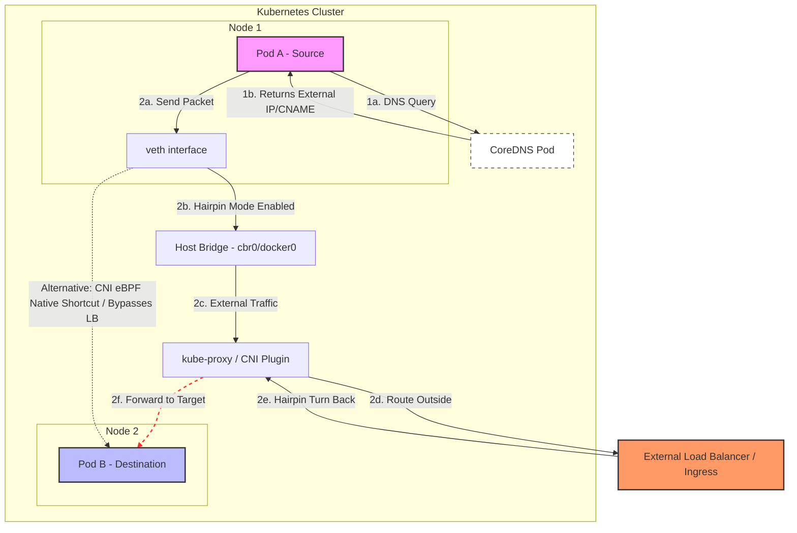

## Day 4

### ipBlock in NetworkPolicy

This can be used to define ingress/egress to specific ipBlocks.

When we define a kubernetes service, we can decide which port of service should be routed to backend port. These ports can be different in the sense, service can define port 8080 and traffic can be routed to backend port 80.

When debugging routing issues, key things to consider

- Service ports are not always backend ports
- Hairpin routing changes policy behaviour. Requests to public endpoints may loop back internally and end up targetting backend pods directly.
- Validate selectors of pods from live resources

### Image Signing

Cosign is one of the way to sign the image and we can use Kyverno policies to enforce running only signed images.

Steps for signing the image

- Install cosign
- Generate signing keys
- Sign the image using cosign generated keys

If we use tags like v1 and sign image based on tags, then signature might look valid even if underlying image has changed. To solved this problem, cosign solves this by signing by digest and not tag. 

When we publish the image, a record is created containing

- image digest (sha256 hash)
- signing certificate
- cryptographic proof that entry exists

We can define `ImageValidationPolicy` in kyverno and use cogisn attestor keys to verify image signature.

There is another option `Sigstore Policy Controller` which is preferred way to validate images.

### Questions

- What is hairpin routing
Hairpin routing in k8s is the network capability that allows a pod to reach itself (or another pod on the same node) through a Service IP, with kube-proxy and the node networking correctly looping the traffic back to destination pod.

### References

- [ipBlock](https://medium.com/@olexandr.kostiuk/when-ipblock-breaks-https-in-kubernetes-debugging-networkpolicy-traefik-and-hairpin-routing-872cba21f7a7)
- [Image Signing](https://cloudsecburrito.com/signed-sealed-and-admitted)
