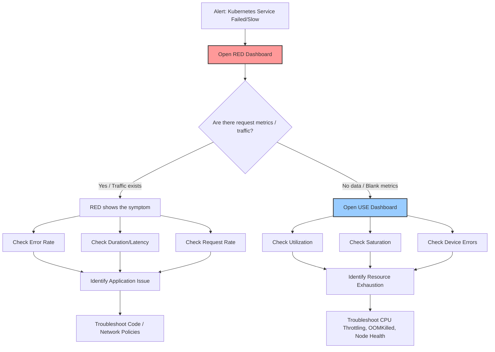

## Day 9

### SRE Guide to Observability

When monitoring a service for failures, two complementary frameworks help pinpoint the root cause: RED and USE.

**RED (scoped to services)**
- **Rate** — Requests per second the service receives
- **Errors** — Requests that failed
- **Duration** — Response time, expressed as p50, p95, and p99

**USE (scoped to device capacity — CPU, memory, network)**
- **Utilization** — How much capacity is in use
- **Saturation** — How much work is queued
- **Errors** — How many device-level faults are occurring

An important distinction: RED errors measure failed requests, while USE errors measure device faults. Both share the letter "E," but they track different things at different layers.

The following diagram maps out a typical troubleshooting flow using both frameworks:



To troubleshoot a service, start with the RED dashboard to identify which service is failing, then move to the USE dashboard to check for underlying device faults.

### Container Escape to Cloud Takeover

Kubernetes allows pods to run with elevated privileges, but misconfiguring them can break container isolation. When a pod definition includes `privileged: true` together with `hostPID: true`, the container is no longer isolated — it shares the host's process namespace and gains access to all host processes. This is a common misconfiguration, especially when deploying and testing legacy workloads.

An attacker who gains access to such a container can escape into the host. For reference, here is the command that exploits these settings:

```sh
# Run inside a container with privileged: true and hostPID: true
nsenter --target 1 --mount --uts --ipc --net --pid -- bash
```

Standard Kubernetes setups depend on `kube-apiserver` pods created from manifests stored at `/etc/kubernetes/manifests`. If an attacker deletes the files in this folder, the API server stops and the entire cluster goes down.

#### Defence Mechanisms

- Never run a pod with `privileged: true`. Apply pod security standards at the namespace level.
- Use OPA or Kyverno to enforce policies at admission time.
- Use runtime security tools like Falco, which can detect `nsenter` usage.
- Disable `hostPID`, `hostNetwork`, and `hostIPC` in Pod Security Policies (PSP).
- Apply stricter controls on access to control plane nodes.
- Monitor `/etc/kubernetes/manifests` with file integrity monitoring (FIM).
- Back up manifests and maintain a documented recovery procedure.

### References
 
- [SRE Guide to Observability](https://www.buoyant.io/blog/the-sre-guide-to-kubernetes-observability-red-vs-use-methods?utm_source=learnk8s-newsletter&utm_medium=email&utm_campaign=oss-federated-services)
- [Container Escape to Cloud Takeover](https://medium.com/@wam0x0x0/from-container-escape-to-cloud-takeover-a-real-world-cloud-security-assessment-018a624e4e6a)